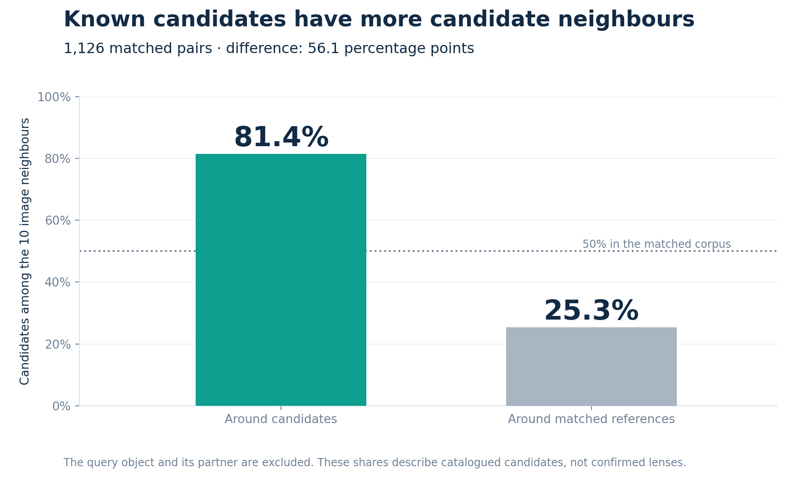
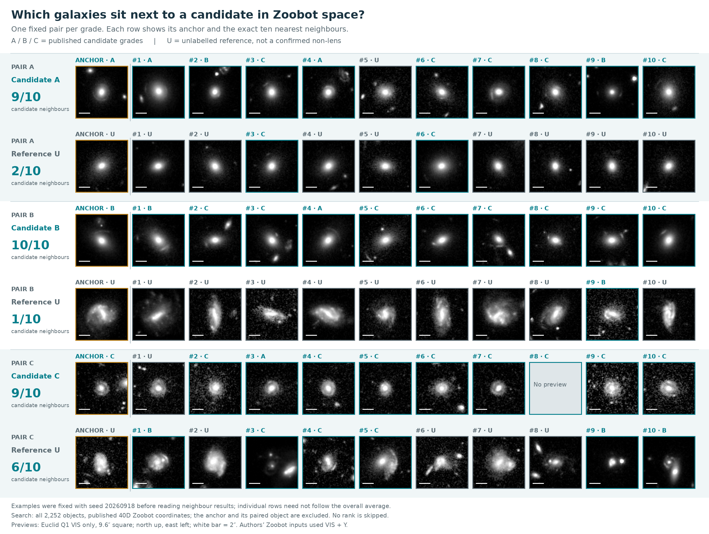

# LensLab · Euclid image neighbours

**Do gravitational-lens candidates have more candidate neighbours than comparable unlabelled galaxies?**

I compare **1,126 Euclid candidates with 1,126 matched references** using published Zoobot representations, then compare Zoobot with frozen DINOv2 on a shared subset. No local fine-tuning.

## Results

Among each object's ten nearest neighbours, **81.4% are catalogued candidates around candidates**, versus **25.3% around references**: a **56.1 percentage-point difference**.



On the **same 118 objects** (59 complete pairs):

| Representation | Around candidates | Around references | Difference |
| --- | ---: | ---: | ---: |
| Zoobot | 80.0% | 38.5% | **41.5 points** |
| DINOv2 ViT-S/14 | 64.6% | 53.2% | **11.4 points** |

Zoobot neighbourhoods align more closely with the catalogue labels in this setup. These percentages measure neighbour composition, **not detection accuracy**.

## Explore



Three pairs selected in advance, one per grade A/B/C; all ten neighbours shown.

- **[Interactive overview](portfolio.html)** — download and open locally to switch pairs, hide labels and enlarge images. In French.
- **[01 · Data and matching](notebooks/01_explore_euclid.ipynb)** — catalogue, images and comparable pairs.
- **[02 · Image neighbours](notebooks/02_image_neighbours.ipynb)** — Zoobot, permutation check and DINOv2.

Both notebooks are executed. [Python code](src/lenslab) · [Numerical summaries and selection records](results).

## Method and limits

References match brightness, apparent size and sky region. Neighbours exclude the query and its partner. The 50% candidate share is constructed; references are not confirmed non-lenses.

**Selection bias:** catalogue construction involved model rankings, including a Zoobot-based lens detector, followed by human grading. This may favour related representations. It is distinct from training on these Q1 images: the published morphology features use a frozen extractor pretrained outside Euclid. Bands and preprocessing also differ between encoders. This is an exploratory representation study, not an independent detection benchmark.

## Reproduce

Python 3.12; CPU supported.

```bash
python -m pip install -r requirements.txt
python run.py --download
python run.py
```

With `lenslab-data.zip`, extract `data/` at the repository root and skip `--download`. Fresh acquisition depends on public services. Data and weights stay outside Git. Intermediate CSVs and extra PNGs are regenerated locally; figures remain embedded in the notebooks or HTML.

**Sources:** [Euclid Q1](https://eas.esac.esa.int/) · [Candidate catalogue](https://zenodo.org/records/15025832) · [Zoobot representations](https://zenodo.org/records/15106473) · [Morphology paper](https://arxiv.org/abs/2503.15310) · [Lens-selection paper](https://arxiv.org/html/2503.15326v2) · [DINOv2](https://huggingface.co/facebook/dinov2-small).

Mohamed Bourega · Independent project. Credit: ESA, Euclid Consortium, Galaxy Zoo volunteers and catalogue/model authors. Zenodo releases: CC BY 4.0; DINOv2: Apache 2.0; other assets retain their source terms.
